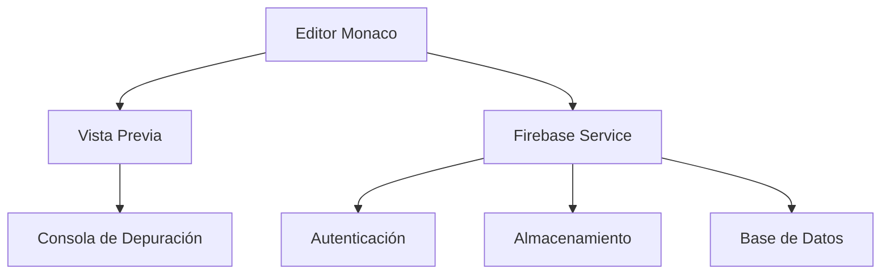
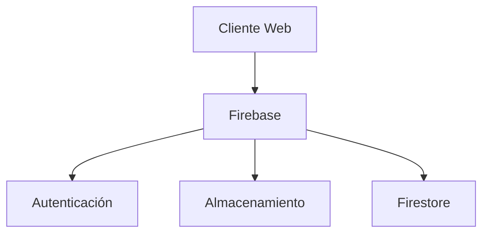
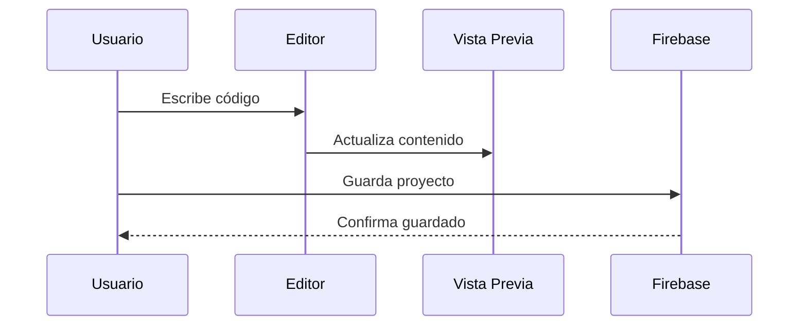

# Documentación de Arquitectura de Software
## Basado en IEEE 1016

### 1. Introducción
#### 1.1 Propósito
Este documento describe la arquitectura del sistema CodeU, incluyendo sus componentes, interfaces y estilos arquitectónicos.

#### 1.2 Alcance
La arquitectura descrita abarca el editor de código colaborativo en tiempo real, su integración con Firebase y los componentes de vista previa.

#### 1.3 Definiciones
- Vue.js: Framework de JavaScript para interfaces de usuario
- Firebase: Plataforma de desarrollo de aplicaciones de Google
- Monaco Editor: Editor de código desarrollado por Microsoft
- Vite: Herramienta de compilación y desarrollo

### 2. Representación de la Arquitectura
#### 2.1 Vista de Componentes

#### 2.2 Vista de Despliegue

### 3. Estilos Arquitectónicos
#### 3.1 Estilo Principal
- Nombre: Arquitectura de Componentes con Vue.js
- Descripción: Arquitectura basada en componentes Vue.js con estado global y servicios de Firebase
- Ventajas:
  - Componentes reutilizables
  - Estado predecible
  - Fácil mantenimiento
  - Escalabilidad
- Desventajas:
  - Curva de aprendizaje para Vue.js
  - Dependencia de Firebase

#### 3.2 Patrones de Diseño Utilizados
- Singleton: Para la gestión del estado global
- Observer: Para la actualización en tiempo real
- Factory: Para la creación de instancias del editor
- Strategy: Para diferentes layouts y modos de vista

### 4. Componentes del Sistema
#### 4.1 Editor de Código
- Responsabilidad: Proporcionar un entorno de edición de código
- Interfaces:
  - Entrada: Eventos de teclado y mouse
  - Salida: Código actualizado
- Dependencias: Monaco Editor, Vue.js

#### 4.2 Servicio de Firebase
- Responsabilidad: Gestionar la persistencia y autenticación
- Interfaces:
  - Entrada: Datos a guardar
  - Salida: Datos recuperados
- Dependencias: Firebase SDK

#### 4.3 Vista Previa
- Responsabilidad: Mostrar el resultado del código
- Interfaces:
  - Entrada: Código HTML/CSS/JS
  - Salida: Renderizado web
- Dependencias: iframe, Vue.js

### 5. Interfaces
#### 5.1 Interfaces Externas
- Firebase API:
  - Protocolo: REST/WebSocket
  - Formato: JSON
  - Seguridad: Autenticación JWT

#### 5.2 Interfaces Internas
- Editor API:
  - Métodos: getValue, setValue, updateOptions
  - Parámetros: string, object
  - Retorno: string, void

### 6. Flujos de Datos
#### 6.1 Flujo Principal

### 7. Decisiones de Diseño
#### 7.1 Decisiones Arquitectónicas
- Uso de Vue.js:
  - Contexto: Necesidad de una interfaz reactiva
  - Alternativas: React, Angular
  - Consecuencias: Mejor integración con Vite

- Integración con Firebase:
  - Contexto: Necesidad de backend en tiempo real
  - Alternativas: MongoDB, PostgreSQL
  - Consecuencias: Escalabilidad y facilidad de uso

### 8. Calidad del Sistema
#### 8.1 Atributos de Calidad
- Rendimiento:
  - Tiempo de carga < 2s
  - Actualización en tiempo real < 500ms
- Escalabilidad:
  - Arquitectura basada en microservicios
  - Caché local
- Seguridad:
  - Autenticación Firebase
  - Sanitización de entrada
- Mantenibilidad:
  - Código modular
  - Documentación completa

### 9. Apéndices
#### 9.1 Glosario
- Componente: Unidad básica de la interfaz en Vue.js
- Estado: Datos que determinan el comportamiento de la aplicación
- Servicio: Clase que proporciona funcionalidad específica

#### 9.2 Referencias
- Documentación oficial de Vue.js
- Documentación oficial de Firebase
- Documentación oficial de Monaco Editor

### 10. Historial de Cambios
| Versión | Fecha | Autor | Descripción del Cambio |
|---------|-------|-------|------------------------|
| 1.0 | 2024-05-02 | Equipo CodeU | Versión inicial | 